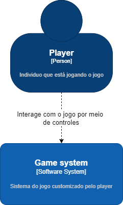

# Fish! Ball! CAT!!

Projeto da disciplina de engenharia de software (MC426) do segundo semestre de 2022. 
Jogo 2D de puzzle e exploração sobre um peixe de estimação de cientistas do mal, feito com a Godot engine.

## Estilos Arquiteturais

A arquitetura decidida tem como base o estilo de camadas (Layering), e para sua implementação foi adicionado aspectos tanto do estilo
mediador, no que tange a interface entre os arquivos de dados guardados em um diretório de database e as componentes do jogo, quanto
do estilo de Objetos na estrutura das componentes principais do jogo, como entidades que interagem com o jogador, mas também se fez necessário
a utilização de uma fábrica abstrata para poder realizar abstrações de objetos do jogo. Assim, os estilos utilizados no projeto foram: *Camadas*, *Mediador*, *Orientação à objetos* e *Abstract Factory*.

## Diagrama de Componentes
Para melhor apresentação da arquitetura utilizada foi usado o modelo C4.

### Nível 1  
No primeiro nível do diagrama é possível observar o contexto em que a aplicação se situa, note que somente ocorre a interação entre o jogador 
e o sistema do jogo. Também é possível perceber que não há interação do sistema do jogo ou do usuário com quaisquer sistemas externos 
a aplicação, visto que o jogo foi desenvolvido dentro de uma Game Engine como o Godot, e portanto o sistema do Godot atua como uma tecnologia para desenvolvimento do software.
Nesse diagrama é possível ver a existencia de um *Software System* chamado Game System, este representa todo o processo realizado pelo jogo.

 

### Nível 2

Seguindo para o nível 2 é possível ver o diagrama de conteiners da aplicação. Perceba que aqui já está sendo considerado o estilo de arquitetura principal seguido pela equipe, esse sendo arquitetura em camadas.
Na camada que tem contato com o player (usuário) está a User Interface (UI) que lida com as interações do player
referentes ao menu e suas configurações, permitindo o usuário selecionar suas preferências para customizar o jogo as suas necessidades,
e também referentes aos inputs de controles, teclados e mouses que podem ser usados no jogo. Logo abaixo
existem o Scene manager e o Game Manager que se responsabilizam respectivamente pela organização posicional de cenas e objetos e 
pela renderização do jogo na camera e progressão da história, os dois containers passam informações entre si para modificar cenas e variaveis constantes entre elas. 
Abaixo está a camada dos Game Objects e suas interações, esses objetos podem receber, das duas databases, assets e 
informações necessarias para a sua construção, eles compõem as cenas dos jogo e podem ser desde leveis, mapas e items até o personagem do player e inimigos.

  

Nesse nível é possível perceber a existência de quatro outros componentes: O primeiro é a interface com o usuário, em que serão coletadas as entradas pelo menu, mouse ou teclado. Esses dados serão organizados e repassados para os componentes Game Manager e Scene Manager. Game Manager deve apresentar o jogo e controlar seu estado de forma mais geral, enquanto Scene Manager consistirá dos objetos e estados das cenas do jogo. Ambas classes trocam dados com Game Object, uma abstração de objetos para as entidades do jogo. Esse último componente recebe dados dos datasets de levels e assets.

### Nível 3
Para o nível 3 o diagrama apresenta os componentes da aplicação mais detalhadamente, apresentando as interações mais próximas entre os containers. As interações são bem complexas então as imagens explicam melhor por si só.
Vale a pena ressaltar, que as posições dos componentes apresentam o formato de camadas, sendo elas 4: Do nível mais próximo ao usuário até o nível mais distante. 

