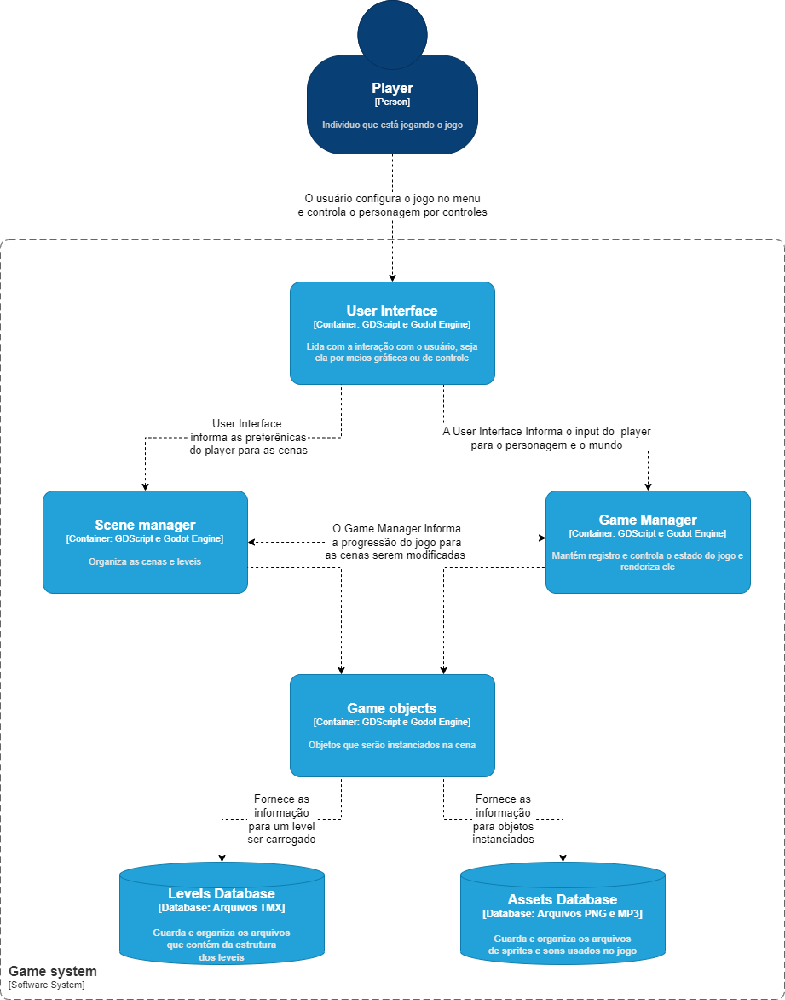
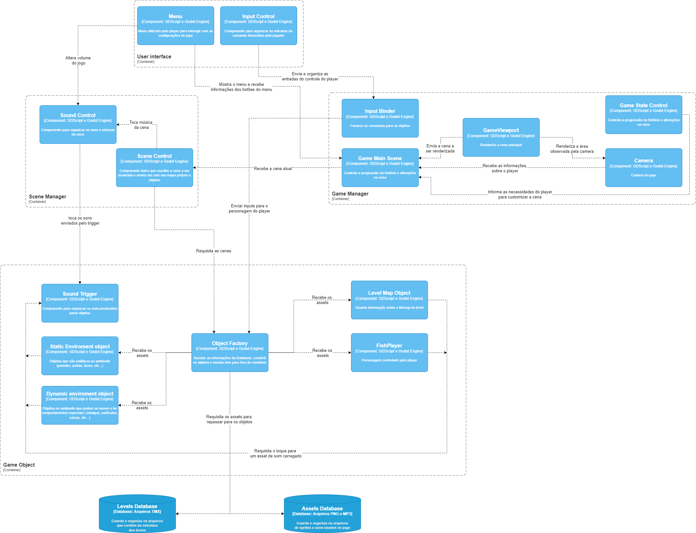

# Fish! Ball! CAT!!

Projeto da disciplina de engenharia de software (MC426) do segundo semestre de 2022. 
Jogo 2D de puzzle e exploração sobre um peixe de estimação de cientistas do mal, feito com a Godot engine.

## Arquitetura
A arquitetura se baseia no estilo de quatro camadas do nível mais próximo ao usuário até o nível mais distante dele. Dessa forma, torna -se necessário a utilização do estilo mediador para realizar a interface dos dados entre componentes, de forma a diminuir o conteúdo transmitido entre elas. Além disso, toda a arquitetura é baseada em orientação de objetos para ser construída. Para as partes mais profundas da arquitetura, também foi necessário a utilização de uma fábrica abstrata para poder realizar abstrações de objetos do jogo.
Assim, os estilos utilizados no projeto foram: *Camadas*, *Mediador*, *Abstract factory* e *Orientação à objetos*.

### Nível 1  
No primeiro nível do diagrama C4 observamos o contexto em que a aplicação se situa, note que somente ocorre a interação entre o jogador e o sistema do jogo. Também é possível perceber que não há interação do sistema do jogo ou do usuário com quaisquer sistemas externos a aplicação.

 

Nesse diagrama é possível ver a existencia de um componente chamado game system. Esse sistema representa todo o processo realizado pelo jogo.
### Nível 2

Seguindo para o nível 2 mostra-se o diagrama de conteiners da aplicação. Perceba que aqui já está sendo considerado o estilo de arquitetura principal seguido pela equipe, esse sendo arquitetura em camadas.  
Aqui o sistema tem como sua base game objects, esses recebem assets das duas databases necessarias para a construção dos objetos do jogo (Levels, inimigos, mapas e objetos estaticos).  
Na camada superior a essa existem o scene manager e o game manager esses se responsabilizam respectivamente para o controle individual de cenas e objetos detro desta cena, enquanto isso o game maneger é responsabilizado pela progressão do jogo. Os dois passam informações entre si para modificar cenas e variaveis constantes entre cenas.  
A ultima camada é a UI que o jogador(user) irá iteragir consistindo do controle do personagem do jogador e menus do jogo, este interage com as cenas de forma a controlar opções de preferencia do jogador pelo menu e interage com o game maneger mandando os inputs necessarios para o personagem do jogador.

  

Nesse nível é possível perceber a existência de quatro outros componentes: O primeiro é a interface com o usuário, em que serão coletadas as entradas pelo menu, mouse ou teclado. Esses dados serão organizados e repassados para os componentes Game Manager e Scene Manager. Game Manager deve apresentar o jogo e controlar seu estado de forma mais geral, enquanto Scene Manager consistirá dos objetos e estados das cenas do jogo. Ambas classes trocam dados com Game Object, uma abstração de objetos para as entidades do jogo. Esse último componente recebe dados dos datasets de levels e assets.

### Nível 3
Para o nível 3 o diagrama apresenta os componentes da aplicação mais detalhadamente, apresentando as interações mais próximas entre os containers. As interações são bem complexas então as imagens explicam melhor por si só.
Vale a pena ressaltar, que as posições dos componentes apresentam o formato de camadas, sendo elas 4: Do nível mais próximo ao usuário até o nível mais distante. 

